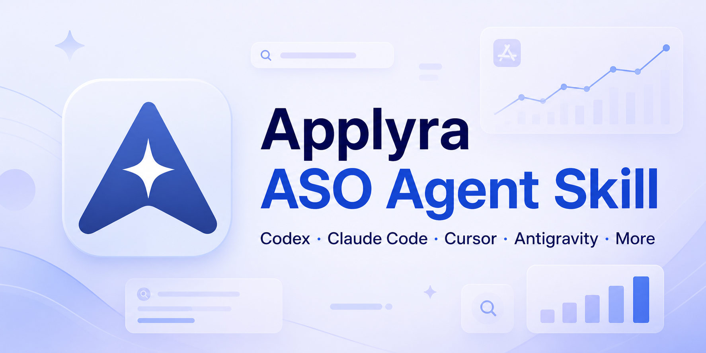

<p align="center"></p>

<h1 align="center">Applyra ASO Agent Skill</h1>

<p align="center">ASO basado en evidencia para Apple App Store y Google Play.<br><a href="README.md">English</a></p>

## Qué hace

Este [Agent Skill](https://agentskills.io/specification) standalone ayuda a
Codex, Claude Code y agentes compatibles con investigación de keywords,
rankings, competidores, metadata validada, localización, creatividades y planes
de medición usando datos de Applyra.

Empieza en modo de solo lectura y no modifica Applyra, publica metadata ni
ejecuta operaciones Git sin autorización explícita.

## Requisitos

- Node.js 20 o superior;
- plan Unlimited de Applyra y `APPLYRA_API_KEY`;
- `@applyra/mcp-server@1.4.2`.

## Conseguir acceso a Applyra

1. Antes de registrarte, [abre Applyra con el enlace referido de LuchoLabs](https://www.applyra.io/?ref=8BA10079167B)
   y crea tu cuenta desde allí.
2. Pasa al plan **Unlimited** para habilitar el acceso API y MCP.
3. Obtén `APPLYRA_API_KEY` desde tu cuenta de Applyra y continúa con la
   instalación del skill y MCP que aparece debajo.

> **Ventaja del referido:** obtienes un **50 % de descuento en tu primer mes de
> Unlimited**. Si continúas durante el segundo mes, LuchoLabs recibe **un mes
> gratis de Unlimited** como crédito de Applyra; las recompensas no tienen valor
> en efectivo. Consulta las [condiciones vigentes del programa](https://www.applyra.io/#faq).
> Este proyecto comunitario independiente no es un repositorio oficial de Applyra.

## Instalación rápida — todos los agentes compatibles

El CLI transversal [`skills`](https://github.com/vercel-labs/skills) detecta
los clientes instalados y permite elegir alcance y destinos:

```bash
npx skills add lucholabs/applyra-aso-skill --skill applyra-aso
```

Para instalar globalmente en todos los clientes compatibles detectados:

```bash
npx skills add lucholabs/applyra-aso-skill \
  --skill applyra-aso --agent '*' --global --copy --yes
```

## Clientes compatibles

| Cliente | Ruta personal/global | Ruta de proyecto | Invocar o comprobar |
|---|---|---|---|
| Codex | `~/.agents/skills/applyra-aso` | `.agents/skills/applyra-aso` | `$applyra-aso` o `/skills` |
| Claude Code | `~/.claude/skills/applyra-aso` | `.claude/skills/applyra-aso` | `/applyra-aso` |
| Cursor | `~/.cursor/skills/applyra-aso` o `~/.agents/skills/applyra-aso` | `.cursor/skills/applyra-aso` o `.agents/skills/applyra-aso` | `/applyra-aso` |
| Google Antigravity | `~/.gemini/config/skills/applyra-aso` | `.agents/skills/applyra-aso` | pedir la lista de skills |
| Antigravity CLI | `~/.gemini/antigravity-cli/skills/applyra-aso` | `.agents/skills/applyra-aso` | `/skills` |
| Gemini CLI | `~/.gemini/skills/applyra-aso` o `~/.agents/skills/applyra-aso` | `.gemini/skills/applyra-aso` o `.agents/skills/applyra-aso` | `/skills list` |
| GitHub Copilot | `~/.copilot/skills/applyra-aso` o `~/.agents/skills/applyra-aso` | `.github/skills/applyra-aso` o `.agents/skills/applyra-aso` | `/applyra-aso` |
| Windsurf | `~/.codeium/windsurf/skills/applyra-aso` o `~/.agents/skills/applyra-aso` | `.windsurf/skills/applyra-aso` o `.agents/skills/applyra-aso` | `@applyra-aso` |
| OpenCode | `~/.config/opencode/skills/applyra-aso` o `~/.agents/skills/applyra-aso` | `.opencode/skills/applyra-aso` o `.agents/skills/applyra-aso` | automático o selector |
| Otros clientes Agent Skills | elegido por `npx skills` | normalmente `.agents/skills/applyra-aso` | selector del cliente |

El instalador universal también soporta Cline, Roo Code, Amp, Goose, Warp, Zed,
Replit, Continue, Devin, OpenHands, Kiro y otros clientes Agent Skills. Sus rutas
nativas cambian más, por lo que conviene dejar que el instalador elija el
destino vigente.

## Instalar en Codex

El flujo estándar es pedirle al instalador incluido en Codex que lo instale. No
hace falta ejecutar Python. Dentro de Codex escribe:

```text
$skill-installer instala applyra-aso desde lucholabs/applyra-aso-skill, ruta applyra-aso
```

Codex instala los skills personales en `~/.agents/skills`. Si no aparece,
reinicia Codex y ejecútalo con `$applyra-aso`.

Para un solo proyecto, copia `applyra-aso/` a
`.agents/skills/applyra-aso/` dentro de ese repositorio.

## Instalar en Claude Code

```bash
git clone --depth 1 https://github.com/lucholabs/applyra-aso-skill.git
mkdir -p ~/.claude/skills
cp -R applyra-aso-skill/applyra-aso ~/.claude/skills/applyra-aso
```

Abre Claude Code y ejecuta `/applyra-aso`. Para un solo proyecto, copia la
carpeta a `.claude/skills/applyra-aso/` dentro de ese proyecto.

## Conectar Applyra MCP

Exporta la clave en el shell que abre el agente; nunca la guardes en Git:

```bash
export APPLYRA_API_KEY="tu-clave"
```

Codex (`~/.codex/config.toml`):

```toml
[mcp_servers.applyra]
command = "npx"
args = ["-y", "@applyra/mcp-server@1.4.2"]
env_vars = ["APPLYRA_API_KEY"]
```

Claude Code:

```bash
claude mcp add --transport stdio --scope user applyra -- \
  npx -y @applyra/mcp-server@1.4.2
```

Abre Claude Code desde el shell donde exportaste la clave y comprueba `/mcp`.

En Cursor, Antigravity, Gemini CLI, GitHub Copilot, Windsurf, OpenCode y otros
clientes MCP, añade un servidor local **stdio** desde sus ajustes MCP:

```text
nombre: applyra
comando: npx
argumentos: -y @applyra/mcp-server@1.4.2
variable de entorno: APPLYRA_API_KEY (heredada del shell que abre el cliente)
```

## Verificar

```bash
python3 applyra-aso/scripts/validate_metadata.py --self-test
bash applyra-aso/scripts/check_setup.sh
```

Python solo ejecuta el validador determinista incluido; no es el instalador de
Codex.

## Actualizar o desinstalar

```bash
npx skills update applyra-aso --global
npx skills remove applyra-aso --global
```

## Documentación oficial

- [OpenAI: crear skills](https://developers.openai.com/codex/skills)
- [Claude Code: skills](https://code.claude.com/docs/en/skills)
- [Cursor: Agent Skills](https://cursor.com/docs/skills)
- [Google Antigravity: Agent Skills](https://codelabs.developers.google.com/getting-started-with-antigravity-skills)
- [Gemini CLI: Agent Skills](https://geminicli.com/docs/cli/using-agent-skills/)
- [GitHub Copilot: Agent Skills](https://docs.github.com/en/copilot/concepts/agents/about-agent-skills)
- [Windsurf: Cascade Skills](https://docs.windsurf.com/es/windsurf/cascade/skills)
- [OpenCode: Agent Skills](https://opencode.ai/docs/skills)
- [Especificación Agent Skills](https://agentskills.io/specification)

## Licencia

MIT. Este proyecto comunitario independiente no es un repositorio oficial de
Applyra.
